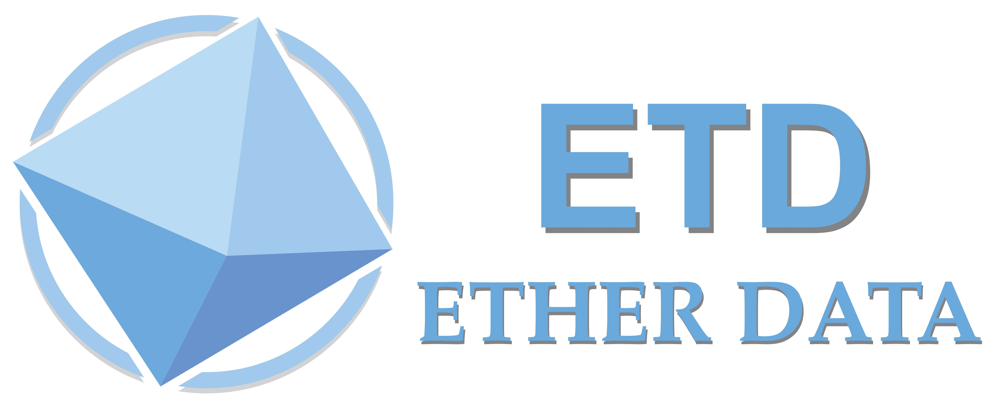

import SimpleProofOfWork from "./components/hash/simple_proof_of_work.jsx";
import Chain from "./components/chain/chain.jsx";
import MyPdf from "./components/etd/etd_pdf.jsx";


# ETD

## 什么是 ETD

ETD 白皮书解释

> 以太數據 ETD(Ether Data)是建立在區塊鏈共識算法和激勵機制之上的 全球一站式通用超級算力平台，結合以太坊智能合約和共享區塊鏈 DSB (Disk Storage Banking) 分佈式存儲和安全計算技術，旨在為共享計算網 絡如伯克利開放式網絡計算平台(BOINC)和其他通用計算平台貢獻公 眾算力的分佈式通用計算系統。Ether Data 定位為易用的高性能應用區塊鏈平台，同時滿足現實科研機 構的計算需求、網絡應用的存儲和計算需求，以及算力貢獻者獲取回報 的經濟需求。 ETD 具備商業化應用需求的特徵，激勵全球用戶將閒置資 源貢獻至專用領域，提供廣泛閒置通用算力的變現經濟渠道。利用低成 本高計算能力的分佈式平台方式，讓冗餘、無效、分散的算力集中發揮 支持實體經濟的價值。



我们先来看下 ETD 白皮书，来了解一下什么是 ETD 吧！

<MyPdf />

之后我们可以通过改变这个现有的数学问题，让电脑可以不断的产生新的问题。譬如现在问题来了，我们下一个的答案需要根据上一个的答案来计算。
什么意思呢

```
初始值1
```

之后我们要寻找结尾有 1 个 0 的数值，同时需要用 1 作为开始的 hash 数值

```
hash(1 + ?) = 结尾有1个0的数值？
假如问号为11
```

之后我们要寻找结尾有 2 个 0 的数值，同时需要用 11 作为开始的 hash 数值

```
hash(11 + ?) = 结尾有2个0的数值？
假如问号为111
```

之后我们要寻找结尾有 3 个 0 的数值，同时需要用 111 作为开始的 hash 数值

```
hash(111 + ?) = 结尾有2个0的数值？
```

就这样，我们每次的新的结果都是根据前面的答案为蓝本进行计算，这样一个链就形成了。注意，我们将第一个的初始值的区块
称为`创世块`。下面这个 demo 将会介绍基础区块链。

<Chain />
