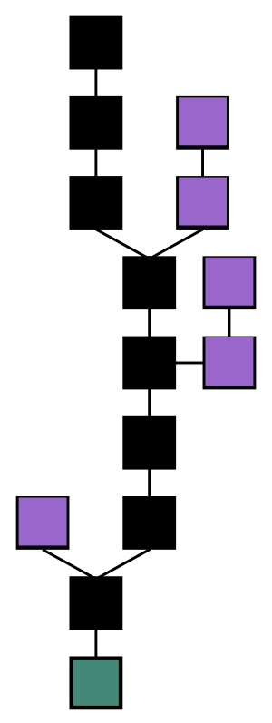

import SimpleProofOfWork from "./components/hash/simple_proof_of_work.jsx"
import Chain from "./components/chain/chain.jsx"

# We don't talk about block chain chain chain chain chain

## 什么是链

根据WikiPedia 对于区块链的定义是
> 每一個區塊包含了前一個區塊的加密雜湊、相應時間戳記以及交易資料（通常用默克爾樹（Merkle tree）演算法計算的雜湊值表示，
這樣的設計使得區塊內容具有難以篡改的特性。用區塊鏈技術所串接的分散式帳本能讓兩方有效記錄交易，且可永久查驗此交易。




我们用上一章学到的知识来讲述一下这个知识点吧，首先我们的pow就是要算出一个Hash 值，这个值要能够达到我们的要求。而为了达到这个值，
我们需要预先提供一个`初始值`给我们的hash 函数，之后每过一个回合，我们的软件就会随机加上一个新的数值，这个叫`nonce`，这样我们就
可以算出一个新的值了。回到之前的例子，看到没有在iteration 是0的时候我们的current Hash 是有的，这个是当前你的电脑的时间的hash后的值。
因此每次刷新都会不同这个值。

<SimpleProofOfWork />

之后我们可以通过改变这个现有的数学问题，让电脑可以不断的产生新的问题。譬如现在问题来了，我们下一个的答案需要根据上一个的答案来计算。
什么意思呢
```
初始值1
```
之后我们要寻找结尾有1个0的数值，同时需要用1作为开始的hash数值

```
hash(1 + ?) = 结尾有1个0的数值？
假如问号为11
```

之后我们要寻找结尾有2个0的数值，同时需要用11作为开始的hash数值

```
hash(11 + ?) = 结尾有2个0的数值？
假如问号为111
```

之后我们要寻找结尾有3个0的数值，同时需要用111作为开始的hash数值

```
hash(111 + ?) = 结尾有2个0的数值？
```

就这样，我们每次的新的结果都是根据前面的答案为蓝本进行计算，这样一个链就形成了。注意，我们将第一个的初始值的区块
称为`创世块`。下面这个demo将会介绍基础区块链。

<Chain />
